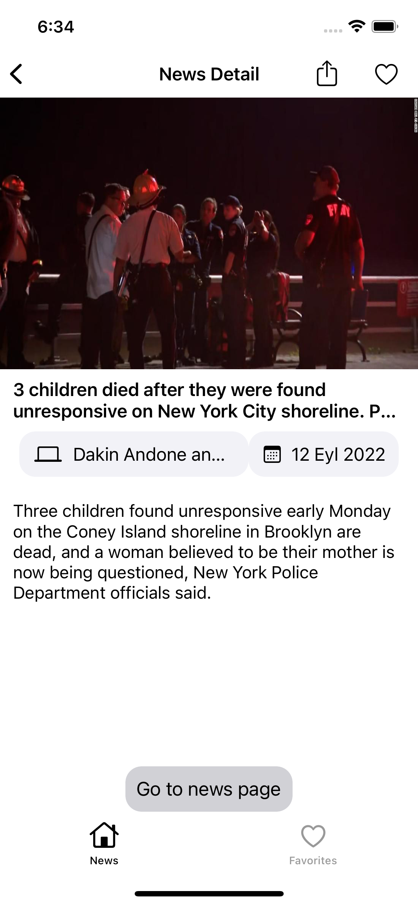

# NewsChallenge

In this application that I developed using NewsAPI, you can search for news and access the details of the news you want and add the news you want to your favourites.

# Features
* MVVM Architecture
* News Search feature
* Favorite news page
* Developed without using a storyboard.

# Pods

```yaml
  pod 'Kingfisher', '~> 7.0'
  pod 'SnapKit', '~> 5.6.0'
```

# Screens
   
 

